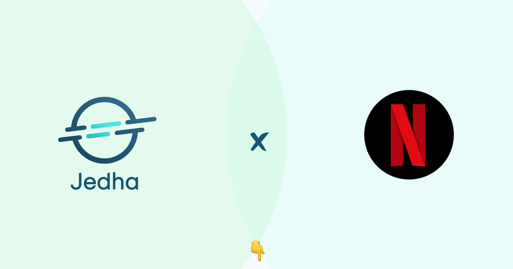

# 🍿 Netflix-recommandation-engine 🍿
This repository houses all resources related to the project presentation on the Netflix recommendation engine. The subject can be found at this address: https://app.jedha.co/course/final-projects-l/netflix-automation-engine-l
 
The presentation video can be accessed at this address: XXXXXX. 
The presentation slides are available in the file Lead_project.pptx. 
Resources, such as the model and training data hosted on Google Drive, can be found at this address: https://drive.google.com/drive/folders/1kdiqpdA-LNxtLTzqqtUPBkfLrpoDvmMJ?usp=sharing 
Below is a description of the content and purpose of each folder in this repository.  
For more information on this project, feel free to contact the repository owner on GitHub : mnicolleUTC.  

# ⚙️ Preprocess ⚙️ 
This folder contains a script that concatenates data from Kaggle. 
The data was extracted from https://www.kaggle.com/code/laowingkin/netflix-movie-recommendation. 
The output files, data_all.csv and filtering.csv can be found on google drive.  

# 🧠 Model_training 🧠 
This folder contains information related to model training. It includes the following files:

- filtering_sample.csv: A CSV file containing a 100k-row data sample, which makes it easier to replicate the data training process. The file size is within GitHub's 100.00 MB limit. The full data file, filtering.csv, can be found on Google Drive.
- model.pkl: A pickle file containing the model used for movie predictions.
- requirements.txt: A text file listing all the Python package dependencies required to run the training Python script.
- train_svd.py: The Python script responsible for training the model.  

# 📡 Kafka_streaming 📡 
This is the folder containing the Kafka streaming process. It includes the following files:
- API_results.py: A Python script that retrieves data from the Jedha API to generate 10 movies/users.
ccloud.lib & python.config: Configuration files for the Kafka producer and consumer, enabling communication through Confluent, the fully managed, cloud-native event streaming platform powered by Apache Kafka.
- consumer.py: A Python script that receives the User's ID, produced by producer.py every 15 seconds.
- Dockerfile: A personalized Docker image that installs GCC and Python dependencies on top of the Kafka-based image provided by Jedha. This corresponds to the build of the Docker image used during the presentation.
- model.pkl: A pickle file containing the model used for movie predictions. This is a copy from the model_training folder.
- movie_titles.csv: A CSV file containing basic information about the movies, which allows for the correspondence between a movie ID and its title.
- producer.py: A Python script that produces a User's ID from the Jedha API.
- requirements.txt: A text file that enables the installation of all required Python packages to run the python scripts. 

## How launch Kafka streaming
Prerequisite: Load credentials.py in your kafka_streaming folder.
Contact the repository owner to obtain the necessary credentials.
- Step 1: Launch two Docker containers (one for the consumer and one for the producer) using the following command: 
docker run -it -v "$(pwd):/home/app" mnicolle/netflix_recommendation
- Step 2: Launch producer.py in one Docker container with the following command:
python producer.py
- Step 3: Launch consumer.py in the other Docker container with the following command:
python consumer.py
- Step 4: Visit mnicolle.pro with the correct port number and refresh the page every 15 seconds to view the recommendation engine in action, producing predictions based on the latest User's ID provided by the producer. 
Note: Pay attention to the number of running containers if the Kafka consumer and producer do not communicate properly. This issue may arise from multiple running instances of either the producer or consumer containers.  

# 🚀 FastAPIdeta 🚀
This API hosts a JSON file that contains the suggested movies produced by the machine learning model. It was initially developed and hosted on Heroku, thanks to Lucas Laborde (#Elwi-nc). However, since the end of Heroku's free-tier version in December 2022, I decided to switch to the deta.space service (https://deta.space/), which is a personal computer in the cloud offering the same features as Heroku but completely free. 
The contents of the folder are as follows:
- .deta: Configuration files for deta.space hosting.
- main.py: A Python script based on the FastAPI framework that contains the code to display the JSON file with the suggested movies produced by the machine learning model.
- requirements.txt: A text file that enables the installation of all required Python packages to run the API script.
- Spacefile: A configuration file for deta.space hosting.  

# ☁️ AWS_server ☁️
This is a web server configured on an EC2 micro-instance (part of Amazon's Free-tier). I wanted to showcase the configuration of an API on a new blank server in my project. The API hosted on this server is based on the Flask framework. The content of this web server has been mapped to the following domain address (which I own for building my future website): mnicolle.fr:8000 (I configured the web server to only be accessed on port 8000). 
The contents of the folder are as follows:
- templates: This folder contains an HTML file ("movies.html") that organizes a basic structure for the front-end display on the website. This folder also contains dependency files called in movies.html.
- main.py: A Python script based on the Flask framework that contains the code to display the suggested movies.
- requirements.txt: A text file that enables the installation of all required Python packages to run the API script.
- install.sh: A script that describes bash instructions that must be run on the AWS server to configure the web server app.
## Connect to the AWS web server
1) Navigate to the ./Netflix-recommendation-engine/aws_server folder.
2) Get your Netflix-project.pem key to access the EC2 server and copy it into the current directory.
3) Run the following command: ssh -i Netflix-project.pem ubuntu@ip_address
## Copy files into the AWS web server
1) Navigate to the repository where you have the file to be copied.
2) Get your Netflix-project.pem key to access the EC2 server and copy it into the current directory.
3) Run the following command: scp -i Netflix-project.pem file ubuntu@13.36.85.253:/home/ubuntu/file_destination
